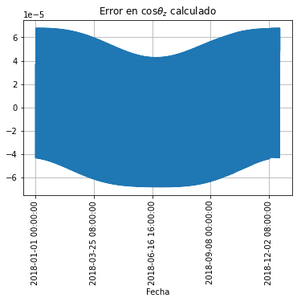
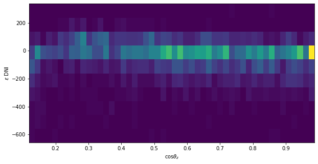
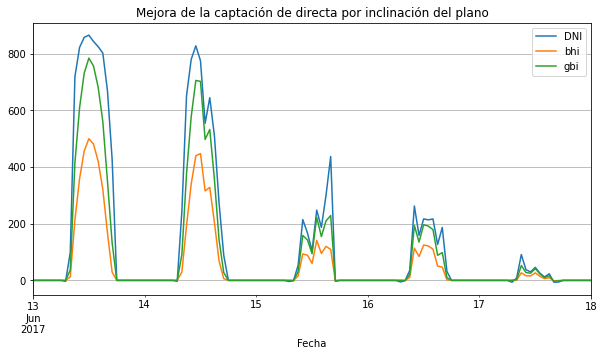

# Práctico 1 -- Radiación solar

Sebastián Santisi [<ssantisi@fi.uba.ar>](mailto:ssantisi@fi.uba.ar)

El presente documento es un resumen del desarrollo realizado
[en esta Notebook de Jupyter](https://colab.research.google.com/github/santisis/frs22/blob/master/practico1.ipynb)

## Ejercicio 0

### Parte a

Implementación en la Notebook.

### Parte b

Parámetros del sol en equinoccio y solsticios:

---

Trayectoria solar:

---

El mediodía ocurre en los siguientes horarios:

*  Mediodía en equinoccio otoño: 12:52:39
*  Mediodía en solsticio invierno: 12:46:20
*  Mediodía en equinoccio primavera: 12:36:47
*  Mediodía en solsticio verano: 12:43:05

## Ejercicio 1

### Parte a

(La visualización de las diferentes variables del punto 0 está realizada en la
Notebook.)

---

Si cuando se habla de día más corto y más largo se considera las horas del sol
estos días son $n = 173, 356$ respectivamente.

Si cuando se habla de día más corto y más largo se considera la duración total
entonces se trata de los máximos y mínimos de la ecuación del tiempo $E$.

Estos son:

*  Mínimo: $E(45) = -14.266350$ minutos
*  Máximo: $E(306) = 16.387239$ minutos

Los mismos tienen una duración de:

*  Duración mínima: 23:45:44
*  Duración máxima: 24:16:23

--

Tenemos las siguientes irradiancias TOA máximas:

*  Irradiación máxima diaria TOA en Montevideo: $44.321566$ MJ/m2,
*  Irradiación máxima diaria TOA en lat +35: $41.465539$ MJ/m2,

donde las mismas se dan en los solsticios de verano austral y boreal
respectivamente.

La diferencia se explica dado que $F_n$ entre esas dos fechas tiene una
variación del orden del 7%, siendo menor en el verano austral.

### Parte b

Teniendo el siguiente gráfico:

Se cree que la mayor radiación recibida en el solsticio de verano se corresponde
con la duración del día que es de casi 2 horas adicionales y compensa el menor
ángulo de elevación solar.

### Parte c

En el día que amanece más temprano:

*  En Rocha amanece a las 05:22:39
*  En Trenta y Tres amanece a las 05:24:34
*  En Cerro Largo amanece a las 05:24:24

Se buscó el valor del amanecer en hora local más temprano del año para cada sitio.

Para sorpresa de nadie, amanece antes en el sitio más al este.

(Cabe destacar que el menor ángulo horario se da el 31/12 para los 3 sitios, no
se descarta que haya algún error de cuentas dado que se hubiera esperado que
esto ocurriera al solsticio y justo ocurre en el último valor de la serie.)

## Ejercicio 2

Para Montevideo:

Puede verse que como lo que se comparan son las horas entre los mediodías
solares de dos días consecutivos termina siendo la derivada de la ecuación del
tiempo $E$.

---

Los días que duran exactamente 24 horas se corresponden con los máximos y
mínimos de $E$, que es cuando la corrección con respecto a la cantidad de horas
es la misma en dos días consecutivos.

## Ejercicio 3

### Parte a

En principio los obstáculos más preocupantes van a ser siempre los que estén al
norte y cercanos. Los objetos que se ecuentran al sur sólo van a hacer sombra
en los amaneceres/atardeceres del verano. En cuanto a los objetos al norte
importa la altura y la distancia; objetos o bajos o a larga distancia no van a
hacer sombra dado que incluso en el invierno el sol les pasará por arriba.

En nuestra configuración, la preocupación principal estará en el Edificio B, el
cual tiene 20 metros de altura, está cercano al emplazamiento, y está en una
dirección del cuadrante norte.

### Parte b

Realizado el diagrama solar:

En este caso puede verse que el edificio de 9 metros de altura que se encuentra
a 30 metros no hace sombra en ningún momento del año. Incluso aunque tuviera el
doble de esa altura no lo haría.

En cambio el de 20 metros ubicado a poco más de 20 metros hace sombra
aproximadamente 120 días al año (aproximadamente 60 días después del solsticio
según el gráfico). El edificio este tiene de ancho 16 grados entre sus dos
lados, por lo que la sombra será aproximadamente 1 hora al día.

## Ejercicio 4

### Parte a

De calcular el $\cos\theta_z$ se obtiene el siguiente error con el del archivo:

Se comprueba que las diferencias son ínfimas, dentro del error de la
representación de un `float`.

---

### Parte b

Se utiliza la turbidez de Linke correspondiente al sur de Uruguay para cada uno
de los meses correspondientes.

Se obtienen los siguientes valores:

En la gráfica de GHI${}_{cc}$ y GHI versus $k_t$ se observa una clara tendencia
a subestimar la irradiancia que aumenta con el valor del $\cos\theta_z$.

### Parte c

Teniendo:

Se observa que el $k_c$ copia la misma tendencia del $k_t$ en función de la
altura solar, lo cual indica que hay una buena modelación de los fenómenos
referidos a masa de la atmósfera $m$ y efectos del ángulo en las componentes
difusa y directa.

### Parte d

(La gráfica de las series temporales completas está en la Notebook.)

Se seleccionan los días 23/12, 21/06 y 2/10 para representar días completamente
despejados lo más cercanos al solsticio de verano, invierno y equinoccio de
primavera respectivamente.

---

Verano:

Se obtienen los siguientes indicadores:

*  MBD: $2.373725$
*  RMSD: $12.701860$

---

Invierno:

*  MBD: $-20.389035$
*  RMSD: $26.717319$

---

Primavera:

Cabe destacar que los días de primavera vienen complicados en la serie dada,
incluso el día elegido parece tener una ligera baja en la GHI a las 15:00 hs.

Se obtiene:

*  MBD: -34.436566
*  RMSD: 37.857421

---

En total se observa que el mejor ajuste se da en el día del verano, pero
observando las series completas se ve que no es un fenómeno estacional sino
que depende de cada día.

## Ejercicio 5

### Parte a

Se filtran los valores con los criterios dados excluyendo estos puntos:

(Las series temporales del año se pueden ver en la Notebook.)

En principio lo que se observa son muchos faltantes de datos en las series.

La comparación del período original de GHI con los datos restantes muestra que
el filtrado extrajo partes de días donde había problemas, pero que quedan
valores de ese mismo día que no parecen del todo correctos.

En muchos lugares (generalmente en días que no pasaron el filtro) se observa
que la GHI coincide con la DHI pero que además hay componente de DNI, por lo
que se espera que la clausura no vaya a cerrar porque son inconsistentes.

Graficando la serie anual de GHI:

Mirando la estacionalidad, salta en eviencia un valor de sobreirradiancia el 13/03 que pasaba desapercibido en las series temporales y que no parece consistente siendo que se están manejando datos horarios y no deberían observarse este tipo de fenómenos.

Llama la atención la irregularidad en el valor mínimo que no parece corresponderse con el filtrado por $\cos\theta_z$, por lo que se presupone que en el amanecer y ocaso ganaron los filtros de GHI, DNI y DHI > 0, o el de la fracción difusa, los cuales evidenciarían mala calidad en los datos.

---

Al trabajar con datos horarios no pueden observarse fenómenos de sombras que se repitan en la serie.

---

Los gráficos de $\cos\theta_z$ versus GHI y $k_t$ son consistentes con una serie sana.

Los gráficos de histograma de $k_t$ y $f_d$ son consistentes con los filtros aplicados. Básicamente, al haber eliminado los instantes de $\alpha_s$ < 7º se eliminan todos los momentos de claridad difusa del amanecer y el atardecer, por lo que los valores altos de $f_d$ están únicamente asociados a días completamente nublados.

### Parte b

Computando la fracción difusa con el modelo de Ruiz-Arias se obtienen las
siguientes estadísticas:

--------------------------------------
              RA1     RA2      RA2s
---- ------ -------- -------- --------
DHI   MBD    12.5%    53.2%    9.61%
      RMSD   48.9%    71.7%    42.6%

DNI   MBD    -5.42%   -25.6%   -5.78%
      RMSD    19.5%    31.4%    18.2%

--------------------------------------

Se elige graficar en este extracto sólo los valores de RA2s, consultar la
Notebook para las series completas.

### Parte c

Región I: $k_t < 0.3$

*  MBD%: 21.513372
*  RMSD%: 126.121397

Región II: $0.3 \leq k_t < 0.65$

*  MBD%: -13.321051
*  RMSD%: 35.818763

Región III: $k_t \geq 0.65$

*  MBD%: -3.899505
*  RMSD%: 13.282177

Se observa un error menor en la región III, asociada a $k_t \geq 0.65$.

---

En cuanto al desempeño en función de la altura se propone graficar el histograma del error en función de $\cos\theta_z$. Parece ser que a valores mayores de la altura solar hay más concentración de valores con bajo error; pero tampoco se observa una tendencia muy marcada en este sentido.

## Ejercicio 6

### Parte a

Se eligen los 5 días a partir del 13/06, donde el 13 es un día de cielo claro y
el tiempo va empeorando siendo el último día totalmente nublado.

### Parte b

Se observa cómo hay una clara ganancia en los días seleccionados (que
corresponden al invierno, donde $\alpha_s$ es bajo) en los momentos donde el
cielo está despejado y similar cuando está completamente cubierto.

En la Notebook se grafican todas las variables que componen la GTI contra las
correspondientes variables de plano horizontal para ver los aportes
individuales. Se incluye únicamente este gráfico:

En base a esos gráficos se observa que el pasaje a plano inclinado eleva mucho la captación de directa, básicamente el ángulo es prácticamente igual a la latitud del sitio.

La componente de reflejada no aporta cantidades significativas.

La componente de difusa está asociada al factor $f$ que incrementa la contribución en días de cielo despejado.

Finalmente, comparando la irradiancia total se observa una mejora significativa en los días en los cuales hay cielo claro, pero la misma cantidad en el caso del día completamente nublado.

## Ejercicio 7

### Parte a

(Implementación: en la Notebook.)

### Parte b

Se eligen dos días en vez de uno, uno en verano ($n=27$) y otro en invierno ($n=165$).

En el caso de panel fijo se observa que en días de verano la captación es menor a la que se obtendría sobre un plano horizontal.

En el caso del seguimiento con un eje, con excepción del cénit en el verano (momento en el que el panel mira al norte), se aprovecha mejor el recurso durante todo el día.

En el caso del seguimiento con dos ejes, los valores simulados se parecen a los de DNI, por lo que el aprovechamiento es máximo.

### Parte c

Totalizando los valores:

*  Ganancia inclinado versus horizontal: 11.4%
*  Ganancia 1 eje versus inclinado: 25.6%
*  Ganancia 2 ejes versus inclinado: 39.6%

Por lo tanto se puede obtener una ganancia del 26% por agregar un eje y del 40%
por agregar dos.

## Ejercicio 8

(En realidad en el Ejercicio 4 no se computaron esas variables, se agregan
utilizando RA2s para la $f_d$.)

### Parte a

(Implementación, en la Notebook.)

### Parte b

Se presenta la variación de $H_a$ de forma porcentual con respecto al ángulo $\beta$:

Se observa que el $\beta_{\mathrm max}$ está en el orden de 39º (la latitud del
sitio es 35º, se hubiera esperado un valor más cercano a la latitud).

Se observa que para:

*  $30 < \beta < 48$ se está en una variación menor al 1%,
*  $19 < \beta < 60$ se está en una variación menor al 5%,
*  $10 < \beta < 69$ se está en una variación menor al 10%.

### Parte c

Tratándose de una aplicación para calefaccionar agua y siendo que la
temperatura a la que se distribuye es similar a la temperatura ambiente,
entonces es necesario utilizar más energía durante el invierno porque hay un
delta mayor entre la temperatura ambiente y la de confort.

Entonces el valor de $\beta$ que maximiza la variación anual no es conveniente
porque se quiere priorizar el período invernal. Por lo tanto se plantea un
valor de $\beta'_{\mathrm max} = \beta_{\mathrm max} + 15 = 54$.

### Parte d

Para una superficie con $\beta =$ 30º se obtiene:

Se observa que:

*  $|\gamma| < 15$ se está en una variación menor al 1%,
*  $|\gamma| < 35$ se está en una variación menor al 5%,
*  $|\gamma| < 50$ se está en una variación menor al 10%.

## Ejercicio 9

### Parte a

Se aplican los filtros sobre un total de 257535 valores obteniendo finalmente
183027, es decir, se eliminó el 29% de los registros:

---------------------------------------------------------------------
 Paso  Criterio                Valores filtrados   Valores restantes
------ ---------------------- ------------------- -------------------
 -2    Registros iniciales     --                  525600

 -1    Existen GHI-DHI-DNI     9694                515906

 0     Registros diurnos       258371              257535

 1     Filtro de GHI           54                  257481

 2     Filtro de DHI           44193               213288

 3     Filtro de DNI           18181               195107

 4     Filtro de $f_d$         5909                189198

 5     Filtro de clausura      6171                183027

---------------------------------------------------------------------

Valores de GHI:

Valores de DNI:

Valores de DHI:

### Parte b

Parece difícil rescatar algún dato de las series estudiadas. Lo más fuerte es
que según las estadísticas de SONDA el grueso de los datos están aprobados.

Por ejemplo, los primeros 13 días del año la DHI es exactamente igual a la GHI
cuando en el período hubo apenas 2 días totalmente nublados.

A partir del día 14 durante la mañana la DNI parece acompañar a la GHI pero a
la tarde se vuelve al comportamiento de los días anteriores.

Este comportamiento parece repetirse hasta el día 186 del año donde parece
solucionarse el problema en la medición de la difusa (es decir, donde la difusa
deja de ser la global).

Caben preguntarse dos cosas:

1.  Según el sitio de SONDA hasta ese día del año el 80% de los registros son
    datos válidos. ¿Contarán como válidas las mediciones nocturnas?

2.  En todos los casos la clausura es correcta, por lo que una de las variables
    es derivada de las otras dos. ¿Cómo puede ser entonces que el filtro de
    clausura eliminó 6200 registros de la serie original, si son computados y
    no medidos?

---

Reiterando el proceso con $n > 186$ se obtiene:

---------------------------------------------------------------------
 Paso  Criterio                Valores filtrados   Valores restantes
------ ---------------------- ------------------- -------------------
 0     Registros válidos       --                  126938

 1     Filtro de GHI           252                 126890

 2     Filtro de DHI           41                  126849

 3     Filtro de DNI           3161                123688

 4     Filtro de $f_d$         2529                121159

 5     Filtro de clausura      3715                117444
---------------------------------------------------------------------

Lo cual es un filtrado de un 8% de los registros. Es decir, si bien el proceso
automático borró muchos datos sobre la serie original, eso fue más un indicador
de la mala calidad y debería haber forzado un análisis manual que los
hermanos brasileros no realizaron.
